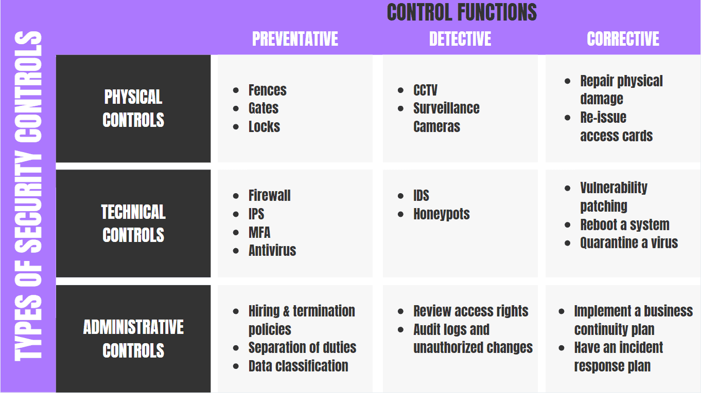

# Lecture Notes: Strategic Policy Development

**Why**

- Why does information security exist?
  - CIA Triad
  - Non-repudiation

- Why do we need to know about compliance regulations and auditing?
  - Often a business driver towards improved cyber policy and posture
  - Cyber (formerly known as "infosec") has its roots in federal systems security, an economic sector laden with regulations
  - Standards such as those established by NIST provide useful frameworks for professionals to work in

**What**

- This week's module is centered around GRC. First, what is **GRC**?
  - GRC refers to a high level strategy for managing the organization's governance, risk management, and compliance with regulations. This is typically something your CSO and management team will oversee, while you operate the day to day systems at the entry level. Let's take a look next at how audits fit into the picture.
    - Governance
    - Risk
    - Compliance (sometimes "control" instead)

- What is **Information Assurance**?
  - Defined by NIST CSRC: Measures that protect and defend information and information systems by ensuring their availability, integrity, authentication, confidentiality, and non-repudiation. These measures include providing for restoration of information systems by incorporating protection, detection, and reaction capabilities.
  - Draw the **CIA Triad** (InfoSec Institute - CIA Triad)
    - Confidentiality
      - ISC2 Definition: Preserving authorized restrictions on information access and disclosure, including means for protecting personal privacy and proprietary information.
      - Principle of least privilege
      - Example of defensive control
      - Encryption
    - Integrity
      - ISC2 Definition: Guarding against improper information modification or destruction and includes ensuring information non-repudiation and authenticity.
      - Example of defensive control
      - Hash validation
      - Certificates
    - Availability
      - ISC2 Definition: Ensuring timely and reliable access to and use of information by authorized users.
      - Can users access the systems?
      - Example of defensive control
      - Automatic failover system
      - Cloud backup
  - Some sources such as NIST extend the triad with two additional components:
    - What is Authentication?
    - What is Non-Repudiation?
  - Vocabulary/concepts/themes

- What are the core concepts of information security?
  - NIST Cybersecurity Framework
  - Information Security Roles and Responsibilities
    - CISO
    - ISSO
  - Information Security Business Units
    - SOC
    - DevOps
    - DevSecOps
    - CIRT

  - **Security Controls Categories**
    - Classified according to their characteristics
      - **Physical**
        - Fences, doors, locks, access-control vestibule (FKA: "mantraps"), and fire extinguishers
      - **Technical**
        - Technical controls are implemented through technology to safeguard systems, networks, and data.
        - Examples include firewalls, intrusion detection systems, antivirus software, encryption, secure authentication mechanisms, and access controls.
      - **Administrative**
        - These controls involve policies, procedures, and guidelines that govern the management of security within an organization.
        - Examples: security policies, access control policies, incident response plans, security awareness training, and risk assessments.
    - Classified by when they act relative to a security breach:
      - **Preventive** - intended to prevent an incident from occurring
        - System Hardening
        - Security Guards
        - Security Awareness Training
      - **Detective** - intended to identify and characterize an incident in progress (sounding the alarm)
        - SIEM
        - Log Monitoring
        - Video Surveillance
      - **Corrective** - intended to limit the extent of any damage cause by the incident
        - IPS
        - Backups and System Recovery
      - **Deterrent** - reduce the likelihood of a deliberate attack
      - **Compensating**- Alternative method put in place to satisfy the requirement for a security measure that cannot be implemented
      - **Recovery** - includes backups and restores, AV, server clustering, disaster recovery sites
      - **Directive** - deployed to direct, confine, or control the actions of subjects to ensure compliance with security policies

  

  Source: [Purplesec](https://purplesec.us/security-controls/)

**How**

- How do we improve a company by adding these controls and operations?
  - Try starting with the NIST CSF
