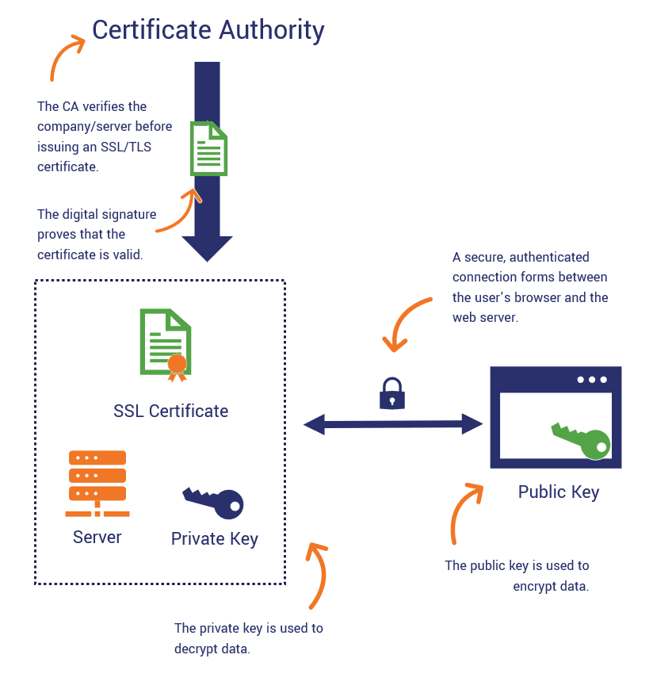
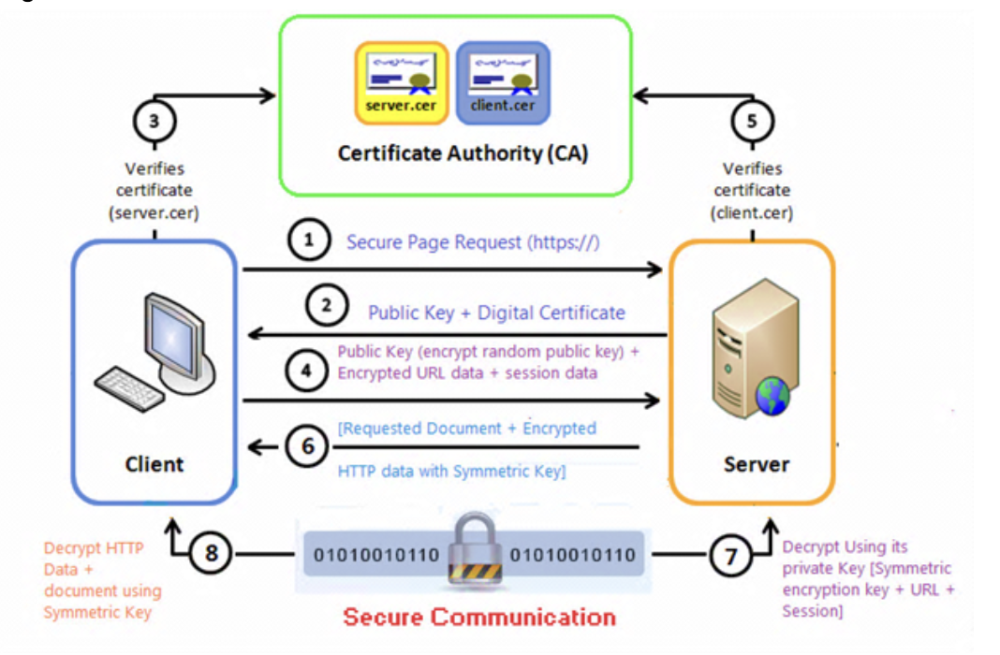

# Lecture Notes: Public Key Infrastructure (PKI)

## Topic 1: Public Key Encryption with Pretty Good Privacy (PGP)

- **Why**

- Why use PGP?
  - Encrypt messages for confidential transmission without having to share the code beforehand, making it very useful.
  - Invented by Paul Zimmerman in 1991 to address the problem of email being insecure and not very confidential/good integrity

  > The infamous NSA whistleblower, Edward Snowden, used the public key encryption tool GNU Privacy Guard when originally working with Glenn Greenwald in 2013 to discuss the leak of thousands of NSA documents: [Watch the video Edward Snowden made to teach journalists email encryption](https://www.dailydot.com/debug/edward-snowden-gpg-for-journalists-video-nsa-glenn-greenwald/). Sadly, Greenwald was still confused. This is a notorious problem with public key encryption.

- **What**

- What is PGP?
  - Public key encryption tool using RSA
  - In Windows, Gpg4win
  - In Linux, GNU Privacy Guard (GPG)

- What is RSA?
  - RSA (Rivest–Shamir–Adleman) is a public-key cryptosystem used for secure data transmission

  > The acronym RSA comes from the surnames of Ron Rivest, Adi Shamir, and Leonard Adleman, who publicly described the algorithm in 1977.

  - In a public-key cryptosystem, the encryption key is public and distinct from the decryption key, which is kept secret (private).
  - RSA is a relatively slow algorithm and not ideal for large sets of data.

- **How**

Ref. [DEMO.md](DEMO.md)

### Topic 2: PKI

- **Why** (5 min)

- Why use Public key infrastructure (PKI) (ref SSH.com)
  - Today’s security professional, particularly at the entry level, needs to have a firm grasp of how and why PKI is used in various systems today.
  - Secure websites
    - Prevents man-in-the-middle attack
    - “Lock” icon in browser - standard user experience
  - Authenticating users and computers
  - Email signing and encryption for confidential message transmission

- **What** (10 min)
- What is PKI?
  - “Public Key Infrastructure (PKI) is a technology for authenticating users and devices in the digital world. The basic idea is to have one or more trusted parties digitally sign documents certifying that a particular cryptographic key belongs to a particular user or device. The key can then be used as an identity for the user in digital networks.” (ref SSH.com)
  - Security functional purpose of PKI
    - Identification
    - Authentication
    - Non-repudiation
    - Confidentiality
  - Vocabulary
    - CA = Certificate Authority
  - Types
    - Symmetric
      - Advantage: Faster
      - Examples: AES-128, AES-192, and AES-256
    - Asymmetric
      - Advantage: Non-repudiation
    - The sender and receiver vouch for who they are with their own private keys
      - Examples: RSA, DSA, and PKCS
  - Diagram: Certificate Issuing Process
    - Recommendation: recreate on a whiteboard, in real time during lecture, the diagram referenced here
      1. Ask CA for certificate
      1. Create key pair and send public key to CA
      1. Verification process
      1. CA digitally signs certificate and sent back to you

    

    Source: [The SSL Store](https://www.thesslstore.com/blog/what-is-a-certificate-authority-ca-and-what-do-they-do/)

  - Diagram: CA role in client-server PKI

    

  - Make sure students can associate an action they take in lab to a process illustrated in the whiteboard diagram you draw for them

- **How** (30 min)
- How is PKI used?
  - Secure websites with HTTPS
    - Discuss why is HTTPS so important to have on all public-facing web servers
      - HTTP is cleartext data transmission between you and the server
      - Glaring reminder that the internet was not designed for security purposes
      - HTTPS is easy to implement so why not?
      - Increase end-user confidence in web server security = better experience on your website
      - Good for defending against MITM and session hijacking although not a perfect defense
    - Why don’t all sites use HTTPS?
      - Show students the Why No HTTPS site
      - Example: Navigate to Boeing.com (or any site without HTTPS but obviously should have it)
      - The lack of HTTPS can lead to negative press about your brand
      - If a company fails to implement a simple protocol like HTTPS, this does not inspire public confidence in the org’s security policies and capabilities
      - Do your company a favor and champion HTTPS
    - How to protect yourself
      - HTTPSONLY browser addon
    - How to install HTTPS on a web site you develop
      - Google Developer Article - How to Set up HTTPS
  - Certificates
    - Windows Server supports CA and certificate assignment
    - OpenSSL
  - Authenticating users and computers with SSH (ref. AWS SSH)
  - Email signing and encryption using Pretty Good Privacy (PGP)
    - OpenPGP is the most current version
      - Original PGP developed in the 90s
    - Backwards compatibility means possibility of downgrade attack
    - PGP is largely considered an insecure encryption method today but sees widespread use
  - Example use case for PKI certificates
    - Your organization is subject to export compliance regulation by the US government. The compliance officer must submit export compliance reports regularly to DECCS, but her computer is prompting for a certificate to validate her identity. Research DECCS policy and diagram the process. (Solution: DECCS FAQ)
